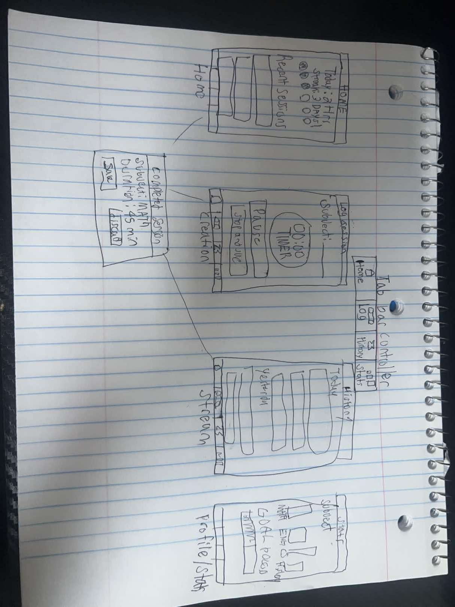
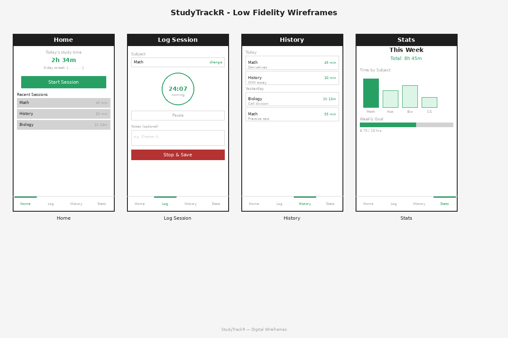

# StudyTrackR

## Table of Contents
1. [Overview](#Overview)
2. [Product Spec](#Product-Spec)
3. [Wireframes](#Wireframes)
4. [Schema](#Schema)

## Overview

### Description
StudyTrackR is an app that lets you time and log your study sessions. You pick a subject, start a timer, and when you're done it saves everything so you can look back and see how much time you've put in. You can also see your streaks and stats by subject to see where you're actually spending your study time.

### App Evaluation
- **Category:** Productivity / Education
- **Mobile:** The main feature is a timer which you'd always use on your phone. You have your phone with you when you're studying anyway so it makes sense. Could also send notifications to remind you to study or tell you when you hit a goal.
- **Story:** A lot of students feel like they study hard but still don't do well. This shows you exactly how much time you're actually putting in by subject. Seeing the hours add up is motivating and streaks make you want to keep going.
- **Market:** Pretty much any student in high school or college would use this. It's a big group and most people don't already have a good solution for this.
- **Habit:** You'd open it every time you sit down to study which could be every day. Once you have a streak going you don't want to break it so it keeps you coming back.
- **Scope:** V1 is just the timer, subject picker, and a history view. V2 adds weekly goals and a basic chart. V3 adds streaks and push notifications. V4 could add social stuff like comparing stats with friends.

## Product Spec

### 1. User Stories (Required and Optional)

**Required Must-have Stories**

* User can log a study session by picking a subject and running a timer
* User can start and stop the timer during a session
* User can see a list of all their past study sessions

**Optional Nice-to-have Stories**

* User can set a weekly hour goal for each subject
* User can see a chart of how much time they've studied per subject this week
* User can see a streak showing how many days in a row they've studied
* User can set a daily reminder notification to study

### 2. Screen Archetypes

- [ ] **Stream** - History Screen
    * User can scroll through all their past sessions
    * User can see the subject, time, and notes for each one

- [ ] **Detail** - Session Complete Screen
    * User can see the full details of the session they just finished
    * User can save or discard the session

- [ ] **Creation** - Log Session Screen
    * User can pick a subject from a list
    * User can start and stop the timer
    * User can add a note before saving

- [ ] **Profile** - Stats Screen
    * User can see a bar chart of study time by subject for the week
    * User can see their total study hours for the week
    * User can see their current streak

- [ ] **Settings** - Goals Screen *(optional)*
    * User can set a weekly hour goal per subject
    * User can turn on or off daily reminder notifications

### 3. Navigation

**Tab Navigation** (Tab to Screen)

* Home
* Log Session
* History
* Stats

**Flow Navigation** (Screen to Screen)

* Home Screen
   * => Log Session Screen (tap start session)
* Log Session Screen
   * => Session Complete Screen (tap stop and save)
   * => Home Screen (tap cancel)
* Session Complete Screen
   * => Home Screen (tap save or discard)
* History Screen
   * => Session Detail Screen (tap on a session)
* Stats Screen
   * => Goals Screen (tap set goals)

## Wireframes

### [BONUS] Digital Wireframes & Mockups

SPRINT ITEMS COMPLETED
- Working TIMER to time study sessions
- Encouraging Quotes on the home screen of the application
- All four of the different screens with their own icons on the bar on the bottom
- Working Stats

Final VIDEO:

    
    
  

